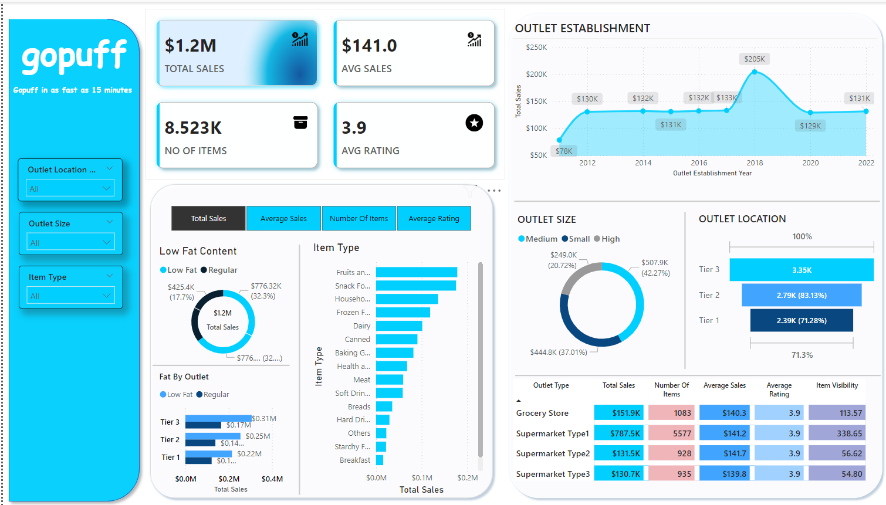

# Gopuff-Sales-Dashboard
Power BI dashboard showcasing sales insights for BlinkIt’s product performance and outlet trends.

# **Gopuff Sales Dashboard 📊**


## 🚀 **Project Overview**
This **Gopuff Sales Dashboard** provides deep insights into product performance, outlet types, and sales distribution across different regions. Built using **Power BI**, it helps stakeholders make data-driven decisions by visualizing key metrics like total sales, average sales, and outlet establishment trends.

---

### 📑 Table of Contents
- [Project Overview](#-project-overview)
- [Data Source](#-data-source)
- [Key Insights](#-key-insights)
- [Features of the Dashboard](#-features-of-the-dashboard)
- [Project Files](#-project-files)
- [Screenshots](#-screenshots)
- [Future Enhancements](#-future-enhancements)
- [Contact](#-contact)
- [Contributing](#-contributing)
- [License](#-license)
- [Acknowledgements](#-acknowledgements)

---

## 📊 **Data Source**
- **Dataset**: BlinkIt Supermarket Sales Data (Kaggle)
- **Columns Included**:
  - `Item Fat Content`
  - `Item Type`
  - `Outlet Identifier`
  - `Outlet Size`
  - `Sales`, `Ratings`, and more...

This dataset provides a comprehensive view of product sales, outlet attributes, and product visibility.

---

## 🧐 **Key Insights**
1. **Total Sales**: $1.2 Million  
2. **Top Outlet Size by Sales**: **Medium** outlets contribute **42.27%** of total sales.  
3. **Highest Sales by Outlet Type**: **Supermarket Type 1** with $787.5K in sales.  
4. **Sales Distribution by Item Fat Content**: 
   - **Low Fat**: $425.4K (17.7%)  
   - **Regular**: $776.3K (32.3%)  
5. **Item Type Performance**: 
   - **Fruits and Vegetables** are the highest selling products.

---

## ✨ **Features of the Dashboard**
- **Interactive Filters**:
  - Select based on **Item Type**, **Outlet Size**, or **Location Tier**.
- **Performance Cards**:
  - Total Sales, Average Sales, and Average Rating in real-time.
- **Year-wise Trend Analysis**:
  - Analyze outlet establishment trends from **2011 to 2022**.
- **Sales by Outlet Size**:
  - Visual donut chart for easy interpretation of sales distribution by outlet size.

---

## 📂 **Project Files**
```bash
Gopuff_Sales_Dashboard/
│
├── dashboard/                # Power BI Dashboard (.pbix)
│   └── Gopuff_Sales_Dashboard.pbix
│
├── data/                     # Data used for the project
│   └── Gopuff_Sales_Data.csv
│
├── screenshots/              # Dashboard screenshots
│   ├── Cleaned Data.png
│   └── Gopuff_Sales_Dashboard.png
│
└── README.md                 # Project README file
```
---

## 📸 **Screenshots**

- **Outlet Performance**


- **Dataset**


---

## 🔮 **Future Enhancements**
- **Add Predictive Analytics**: Forecast future sales trends.
- **Incorporate Machine Learning**: Use clustering to identify high-performing outlets.
- **Embed in Web Application**: Deploy the dashboard using Power BI Service.

---

## 📬 **Contact**
If you have any questions or suggestions, feel free to contact me:

- **GitHub**: [prabhatkumarsahu7](https://github.com/prabhatkumarsahu7)  
- **Email**: prabhatkumarsahu768@gmail.com

---

## 🌟 **Contributing**
If you'd like to contribute to this project, feel free to **fork** the repository and submit a **pull request**. All contributions are welcome!

---

## 🙌 **Acknowledgements**
- Thanks to **Kaggle** for providing the dataset.
- Inspired by **BlinkIt** and its real-time delivery services.

